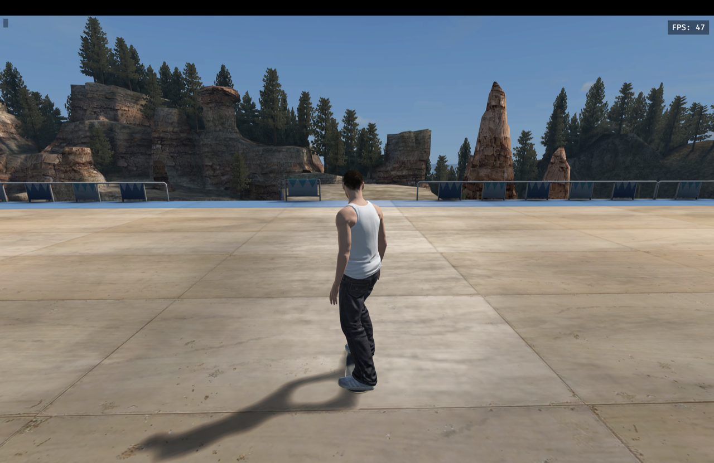

# macOS (Apple Silicon MacBook) port



Tested target: Apple Silicon MacBook (M1/M2/M3/M4), macOS 14+, `aarch64-apple-darwin`.
Intel Macs should also build (`x86_64-apple-darwin`) but are untested.

This checkout already contains the port changes (branch `macos-port`). Upstream
`main` is Windows-only: Vulkan + XInput + `.exe`/`.dll` helpers + Win64-only
asset tools. This document explains what changed and how to run it.

## What was blocking macOS

| # | Windows-only assumption | macOS fix in this checkout |
|---|---|---|
| 1 | `app.rs` forces `Backends::VULKAN`. Macs have no native Vulkan. | `Backends::METAL` on `target_os = "macos"`, Vulkan elsewhere. |
| 2 | `input/platform.rs` only implements XInput; every other OS returns `UnsupportedPlatform`, so no controller is ever `Ready`. `GilrsPlugin` is also disabled unconditionally. | New `desktop` backend polls `gilrs 0.11.2` (same version Bevy 0.18.1 uses) and maps it to the XInput ABI the TU3 converter expects. `GilrsPlugin` stays disabled on Windows, enabled on macOS. |
| 3 | `setup.rs` / `updater.rs` / `custom_models.rs` hard-code `support/skate3setup.exe`, `support/skate3update.exe`. `multiplayer/transport.rs` hard-codes `steam-relay/skate-steam-relay.exe` + `steam_api64.dll`. | New `platform_bins.rs` returns extension-less names on Unix and `libsteam_api.dylib` on macOS. Direct (non-Steam) multiplayer works without the relay. |
| 4 | Dev `wgpu` dependency enables only the `vulkan` backend feature; headless shader probe hard-codes `VULKAN`. | Dev `wgpu` enables `vulkan` + `metal`; probe selects per-OS. |
| 5 | `tools/asset_pipeline/fast_refpack.py` only loads `refpack.dll`. | Loads `.dylib`/`.so` on Unix, `.dll` on Windows. Built by `scripts/build-macos.sh` to `target/native/librefpack.dylib`. |
| 6 | `tools/asset_pipeline/install.py` XISO URL is Win64-only and `dependency()` only finds `name.exe`. | Per-OS pinned XboxDev URLs (Win64/macOS/Linux, same `build-202505152050`), extension-less binary lookup, `chmod +x` on Unix. |
| 7 | Mixamo importer hard-codes `tools/FBX2glTF.exe` + Win64 SHA; VC++ DLLs asserted unconditionally. | New `tools/mixamo_to_skate/fbx_tool.py` (v0.9.7 pins for Windows + macOS darwin-x64); all call sites (`converter.py`, `library_import.py`, `main.py`, `check_package.py`) use it; CRT-DLL assertions are Windows-only. |
| 8 | Only `BUILD.bat` / `PLAY.bat` / `*.ps1`, CI only `windows-2025`. | `scripts/build-macos.sh`, `scripts/launch-macos.sh`, `scripts/download-macos-deps.sh`, `scripts/prepare-character-importer-macos.sh`, `scripts/build-macos-release.sh`, `.github/workflows/macos.yml`. |

Pure-logic crates (`skate-core`, `skate-data`, `skate-net`, `skate-vehicles`,
`skate-mods`) needed no changes.

## Prerequisites

Tooling requires Python 3.11+ (the project pins 3.13; macOS system Python 3.9
fails on `hashlib.file_digest`). Everything downloadable is fetched by one script:

```bash
./scripts/download-macos-deps.sh
```

It installs/verifies: Xcode CLT, Rust stable, Homebrew `python@3.13` + `tools/requirements-setup.txt`,
`extract-xiso` (macOS, hash-pinned), FBX2glTF (darwin, hash-pinned),
and builds `target/native/librefpack.dylib`.

What it deliberately does NOT fetch: **the Skate 3 Xbox 360 disc dump**.
Provide your own: either an `.iso` or (recommended, skips extraction) an
already-extracted folder containing `default.xex` + `data/`. Game assets are
never downloaded and never included.

You also need an Xbox/PlayStation/8BitDo-style pad. macOS exposes pads via
HID; `gilrs` reads them without drivers. Keyboard-only play is **not**
supported — the engine consumes raw pad packets.

## Build

```bash
./scripts/build-macos.sh
# release (slower, faster game):
./scripts/build-macos.sh --release
```

The staged binary is built with `--no-default-features` (static Bevy) so
`bin/skate3rust` runs standalone; the default dynamic build only runs via
`cargo` (its Bevy dylib lives under `target/debug/deps`). First build takes a
while (static Bevy); later builds are incremental. First run refreshes
`Cargo.lock` for the non-Windows `gilrs` edge.

## Assets (one time)

Converted assets live beside the checkout in `assets/` for development:

```bash
# extracted-folder path (recommended, skips extract-xiso):
python3 tools/prepare_assets.py \
  --game-root /path/to/extracted/SKATE3 \
  --output "$PWD/assets" \
  --game-exe "$PWD/bin/skate3rust"
# ...or point --game-root at your .iso; setup downloads the pinned macOS
# extractor automatically.
```

Full conversion (10 maps + skater) takes several minutes and several GB.
Afterwards:

```bash
./scripts/launch-macos.sh
# or a specific map:
./scripts/launch-macos.sh maps/University.skate
```

In-game: Esc opens graphics/difficulty/map settings. Maps switch without
restarting.

## Custom Models (Mixamo FBX) on macOS

```bash
./scripts/prepare-character-importer-macos.sh   # -> target/importer-runtime/FBX2glTF
# then pass it explicitly, e.g.:
python3 tools/mixamo_to_skate/main.py --fbx-tool target/importer-runtime/FBX2glTF ...
```

The darwin asset is an Intel (`x86_64`) Mach-O binary; Apple Silicon runs it
via Rosetta 2 (the script installs Rosetta if missing).

## Release packaging and CI

- `scripts/build-macos-release.sh [--dev]` stages a `skate3rust-macos-arm64`
  directory (static binary, `support/` with RefPack dylib + importer,
  mods, docs, licenses), writes a `release.json` manifest (`target:
  macos-arm64`, file hashes, asset-pipeline fingerprints reused from the
  Windows tooling), and produces `target/skate3rust-macos-arm64.zip` +
  `.sha256`. `--dev` stages the dev-profile binary for speed (CI); without it
  a `--release` binary is built. The PyInstaller `skate3setup` bundle still
  has no macOS build, so releases serve the `--assets` flow.
- `.github/workflows/macos.yml` runs on `macos-15`: toolchain setup, both
  `cargo check` configurations, unit tests (see below), tooling smoke checks,
  staged build + launch smoke test, dev packaging, artifact upload.

## Test report (M4 Pro, macOS 27, ARM64)

- `cargo check` / `cargo build -p skate-game`: clean, no errors.
- New gilrs platform cache test: passes.
- `skate-data`, `skate-net`: all pass.
- 5 failures verified **pre-existing** (each fails identically on unmodified
  `main` via `git stash`, so not regressions from this port):
  - `skate-core`: `broadphase_tests::predictive_contacts_and_retention...`
    compares raw float bit patterns tuned on x86-64; ARM64 NEON/FMA differs
    in the last ULP. Skipped in macOS CI with a comment.
  - `skate-game` (4): grind-handler routing count, rwcm contact-toolkit
    query IDs, replay scrub input leak, windowless render-adapter probe —
    macOS-environment issues (no HID pads, no windowed GPU, fixture
    assumptions). Windows CI still runs them; skipped in macOS CI with
    comments.
- `tools.asset_pipeline.test_versions`: passes under Python 3.13 (CI);
  locally under system Python 3.9 it errors on `hashlib.file_digest`
  (3.11+ API) — another reason the project pins 3.13.

## Known macOS gaps (honest list)

- **Steam lobbies**: `skate-steam-relay` compiles on macOS in principle
  (`steamworks 0.13.1` ships a macOS SDK), but the Steam client + overlay on
  Apple Silicon is Intel-only and untested here. **Direct UDP multiplayer**
  (`--net-host` / `--net-local`) is the supported path on Mac.
- **Setup GUI**: `tools/setup.py` runs on macOS with python.org Tk, but the
  *packaged* `skate3setup` helper (PyInstaller bundle) has no macOS build
  yet — hence the `--assets` dev flow instead of first-launch setup windows.
- **Performance**: the vendored `bevy_pbr`/`bevy_core_pipeline` patches were
  tuned against Vulkan validation layers. They are backend-agnostic bind-group
  caches, but frame-time numbers on Metal need re-measuring
  (`docs/cpu-followup-optimizations.md`, `--trace`).

## Files changed

- `crates/skate-game/src/app.rs` — Metal backend, conditional GilrsPlugin
- `crates/skate-game/src/input/platform.rs` — gilrs desktop transport
- `crates/skate-game/Cargo.toml` — `target.'cfg(not(windows))'.dependencies.gilrs`, wgpu metal feature
- `crates/skate-game/src/platform_bins.rs` *(new)* — portable helper names
- `crates/skate-game/src/{updater,setup,custom_models}.rs`, `multiplayer/transport.rs` — use it
- `crates/skate-game/src/{input,main,retail_shader_tests}.rs` — platform-neutral log/probe
- `tools/asset_pipeline/{fast_refpack,install}.py` — dylib + per-OS XISO pins
- `tools/mixamo_to_skate/{fbx_tool.py (new),converter,library_import,main,check_package}.py` — platform-aware importer
- `scripts/{build-macos,launch-macos,download-macos-deps,prepare-character-importer-macos,build-macos-release}.sh` *(new)*
- `.github/workflows/macos.yml` *(new)*
